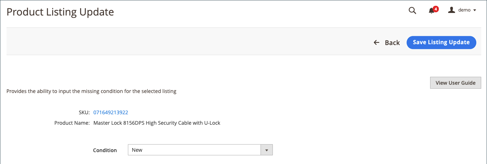

# 必要な情報を更新（リストが不完全です）

次に表示されるリスト： _[!UICONTROL Incomplete]_タブに [!DNL Commerce] カタログ製品は、リストルールで定義されたAmazonの適格要件を満たしていますが、リストする前にAmazonで必要な情報が不足しています。

## 必要な情報を更新します (Amazonリストに割り当てられません ) {#update-required-info-unable-to-assign-to-amazon-listing}

1. 一覧を _[!UICONTROL Incomplete]_タブ [リストの管理](./managing-product-listings.md).

1. 内 _[!UICONTROL Action]_列、クリック&#x200B;**[!UICONTROL Select]**>**[!UICONTROL Update Required Info]**」をクリックします。

1. Amazonリストと照合しようとしているカタログ製品情報（SKU および製品名）を確認します。

1. の場合 **[!UICONTROL Assign ASIN]**&#x200B;カタログ製品に一致させるリストに対して、Amazonが割り当てた ASIN を入力します。

1. 製品の一致を保存するには、 **[!UICONTROL Save Listing Update]**.

これで、リストがカタログと一致し、cron およびリストの設定に基づいて、リストが更新されてAmazonに公開されます。 また、 _[!UICONTROL Incomplete]_タブをクリックします。

{width="600" zoomable="yes"}

## 必要な情報を更新します（複数件の一致が見つかりました） {#update-required-info-multiple-matches-found}

1. 一覧を _[!UICONTROL Incomplete]_タブ [[!UICONTROL Manage Listings]](./managing-product-listings.md).

1. 内 _アクション_ 列、クリック **選択** > **必要な情報を更新** 」をクリックします。

1. Amazonリストと照合しようとしているカタログ製品情報（SKU および製品名）を確認します。

1. の場合 **[!UICONTROL Select Correct Amazon Listing]**、この製品に一致させるリストに適した ASIN を選択します。

   ここに示すオプションには、一致すると見なされるカタログ製品が含まれます。 どのオプションも正しくない場合は、 `Manually Enter Correct ASIN` 製品の ASIN を手動で入力します。

1. ASIN を手動で入力する場合は、 **[!UICONTROL Manually Assign ASIN]**.

1. 製品の一致を保存するには、 **[!UICONTROL Save Listing Update]**.

{width="600" zoomable="yes"}

## 必要な情報を更新（バリアントが含まれる） {#update-required-info-has-variants}

1. 一覧を _[!UICONTROL Incomplete]_タブ [[!UICONTROL Manage Listings]](./managing-product-listings.md).

1. 内 _[!UICONTROL Action]_列、クリック&#x200B;**[!UICONTROL Select]**>**[!UICONTROL Update Required Info]**」をクリックします。

1. Amazonリストと照合しようとしているカタログ製品情報（SKU および製品名）を確認します。

1. の場合 **[!UICONTROL Select Correct Amazon Listing]**、この製品に一致させるリストに適した ASIN を選択します。

   ここに示すオプションには、一致すると見なされるカタログ製品が含まれます。 どのオプションも正しくない場合は、 `Manually Enter Correct ASIN` 製品の ASIN を手動で入力します。

1. ASIN を手動で入力する場合は、 **[!UICONTROL Manually Assign ASIN]**.

1. 製品の一致を保存するには、 **[!UICONTROL Save Listing Update]**.

## 必要な情報を更新（条件が見つかりません） {#update-required-info-missing-condition}

1. 一覧を _[!UICONTROL Incomplete]_タブ [リストの管理](./managing-product-listings.md).

1. 内 _[!UICONTROL Action]_列、クリック&#x200B;**[!UICONTROL Select]**>**[!UICONTROL Update Required Info]**」をクリックします。

1. Amazonリストと照合しようとしているカタログ製品情報（SKU および製品名）を確認します。

1. の場合 **[!UICONTROL Condition]**、適切な条件を選択します。

   使用可能なオプションのリストは、 [製品リスト条件](./product-listing-condition.md) 設定。

1. 製品の一致を保存するには、 **[!UICONTROL Save Listing Update]** .

{width="600" zoomable="yes"}
