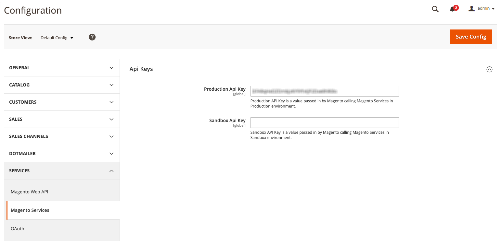

# Amazon API キーを追加または確認する

Amazon 販売チャンネルにアクセスすると、は、 [!DNL Commerce] ストア設定に追加された AMAZON API キーを自動的に確認して検証します。 有効にした場合は、次の手順 (ストア統合) に進むことができ  ます。

Amazon API キーが不足しているか、無効であるか、または期限切れである場合は、キーを更新する必要があります。 API キーを取得して、Amazon sales channel 設定にキーを追加するように求めるメッセージが表示されます。

## プロンプトに従って、Amazon API キーを取得して追加します。

この API キーは、Amazon 販売チャンネルにアクセスするたびに検証されます。

1. [!DNL Commerce]管理者にログインします。

1. 傍注については _[!UICONTROL Admin]_、**[!UICONTROL Marketing]**>_[!UICONTROL Channels]_ > を参照して **[!UICONTROL Amazon Sales Channel]** ください。

   最初に Amazon 販売チャンネルへのアクセスが必要な場合、または API キーを更新する必要がある場合は、システムによりプロセスが確認されます。

   

1. **[!UICONTROL Sign in]** Web アカウントにアクセスするには、をクリックし [!DNL Commerce] ます。

   新しいブラウザータブに Commerce アカウントページが表示されます。

   - アカウントにログインしている場合は、 [!DNL Commerce] _[!UICONTROL API Portal]_ページのセクションが_[!UICONTROL My Account]_ 自動的に表示されます。

   - ログインしていない場合は、タブが表示される [!DNL Commerce] 前に、アカウントのユーザー名とパスワードの入力を求めるメッセージが表示され _[!UICONTROL API Portal]_ます。

   - 取引先企業が登録されていない場合は、「 [  [!DNL Commerce]  取引 ](https://account.magento.com/customer/account/login/) 先企業」ページ {target = &quot;_blank&quot;} に移動して登録します。 このアカウントは、会社や業務に参加している必要があります。

1. 必要に応じて、アカウントのタブに表示されている API キーを表示して生成することもでき _[!UICONTROL API Portal]_[!DNL Commerce] ます。

   API キーを作成するには、説明を入力してを `Amazon Sales Channel` クリックし **[!UICONTROL Add New]** ます。 新しいキーが生成され、入力した名前が表示されます。 **[!UICONTROL Copy]**&#x200B;新規キーをコピーするには、をクリックします。

   

1. 新しいキーを作成してコピーしたら、ブラウザーのタブに戻り _[!UICONTROL Amazon Sales Channel]_ます。

1. ページで _[!UICONTROL Welcome to Amazon Sales Channel]_をクリックし&#x200B;**[!UICONTROL Add the key]**ます。

   ブラウザーによって Amazon sales channel と「store configuration」ページが表示され _[!UICONTROL Api Keys]_[!DNL Commerce] ます。 このページは、> > を表示したときに手動で開くことができ&#x200B;**[!UICONTROL Stores]**_[!UICONTROL Settings]_ **[!UICONTROL Configuration]** **[!UICONTROL Services]** ます。左側のパネルを展開して、を選択することもでき **[!UICONTROL Magento Services]** ます。

1. にコピーされたキーをペースト **[!UICONTROL Production Api key]** します。

1. をクリックし **[!UICONTROL Save Config]** ます。 これで、Amazon sales チャンネルに戻ることができます。

   

1. 傍注については _[!UICONTROL Admin]_、**[!UICONTROL Marketing]**>_[!UICONTROL Channels]_ > を参照して **[!UICONTROL Amazon Sales Channel]** ください。

   Amazon 販売チャンネルトリガーにアクセスすると [!DNL Commerce] 、API キーが検証され、検証されます。続行することもできます。

   キーの再確認を求めるメッセージが表示された場合は、再度、 _追加と検証を行い_ ます。

 [**は、統合の保存にも続きます。**](./store-integration.md)
