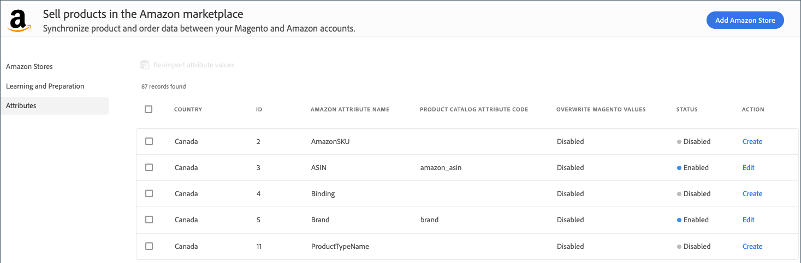

# Attributes

このビューには、 _[!UICONTROL Attributes]_Amazon と属性の一覧が表示さ [!DNL Commerce] れます。 このリストには、製品マッチングにマップされている属性も示されます。 詳しくは、属性の管理を参照してください  。

ビューから _[!UICONTROL Attributes]_、テーブル内の属性設定を確認して属性を [ 作成または編集することができ ](./creating-attributes.md) ます。

## 属性リストを表示します。

1. _管理者は_ 、> > を参照して **[!UICONTROL Marketing]** _[!UICONTROL Channels]_**[!UICONTROL Amazon Sales Channel]**ください。

1. **[!UICONTROL Attributes]**&#x200B;左側のメニューで「Amazon」属性を探して、属性リストを確認してください。

1. 必要に応じて、次のように属性を作成または編集します。

   -  属性に一致する属性値を作成して定義するには、をクリックし **[!UICONTROL Create]** ます。

   - [属性の設定または一致する属性値を無効化または編集するには ](./creating-attributes.md#edit-an-attribute) 、をクリックし **[!UICONTROL Edit]** ます。

      属性の編集には、製品の照合の属性マッピングの変更が含まれています。

| 名 | つい |
|--- |--- |
| [!UICONTROL Country] | **[!DNL Amazon Marketplace]** 店舗統合中に国で定義された営業活動の国  。 |
| [!UICONTROL ID] | 属性の作成時によって生成される汎用属性値 [!DNL Commerce] です。 |
| [!UICONTROL Amazon Attribute Name] | Amazon からインポートされた属性の名前を指定します。 |
| [!UICONTROL Product Catalog Attribute Code] | マップされている場合は、 [!DNL Commerce] カタログと一覧製品を一致させるためにに割り当てられた属性がに割り当てられ _[!UICONTROL Amazon Attribute Name]_ます。 |
| [!UICONTROL Overwrite Magento Values] | 属性設定に属性が設定されている場合 `Overwrite Existing Magento Values` 、テーブルにはが表示され `Enabled` ます。 有効にすると、属性の更新された製品情報を Amazon から受け取ったときに、新情報によってカタログ内の製品についての情報が更新されます (上書きされ [!DNL Commerce] ます)。 また、ストアに一覧表示されている製品にも影響を与える可能性が [!DNL Commerce] あります。 |
| 現状 | 属性値が属性にインポートされ、マップされているかどうかを示し [!DNL Commerce] [!DNL Commerce] ます。 オプション: `Enabled` / `Disabled` |
| アクション | 属性に対して使用可能なタスクオプションを指定します。 オプション: `Create` / `Edit` |
