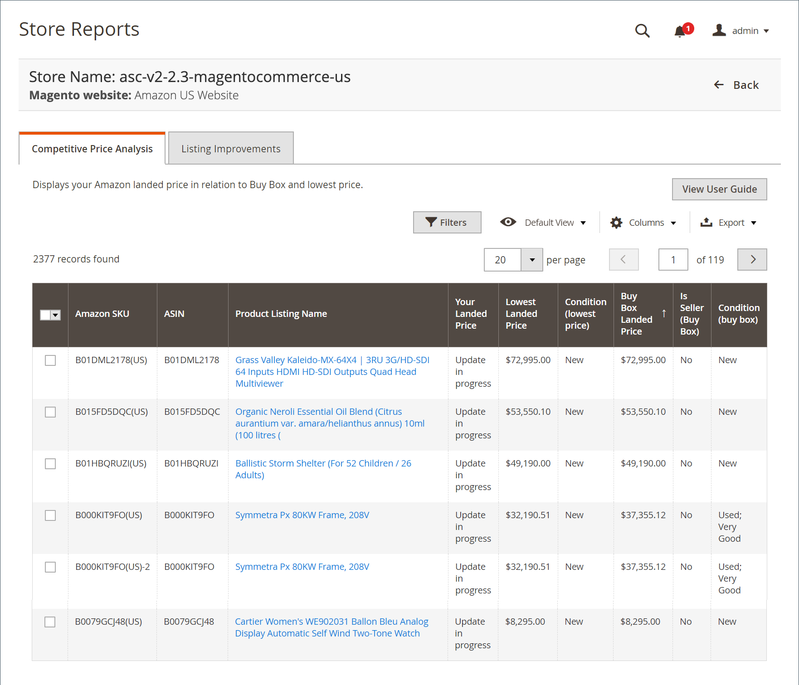

# 競争価格分析レポート

Competitive Price Analysis レポートには、マーケットプレイスごとのAmazonのリストが、それぞれの [Buy Box](./buy-box-competitor-pricing.md) 価格および [ 最低の競合相手 ](./lowest-competitor-pricing.md) 価格で表示されます。 ログに使用可能なアクションはありません。 これはレビューのみの機能です。

{width="600" zoomable="yes"}

## デフォルトの列

| 列 | 説明 |
|---------------------------------------|------------------------------------------------------------------------------------------------------------------------------------------------------------------------------------------------------------------------------------------------------------------------------------------------------------------------------------------------------------------------------------------------------------------------------------------------------------------------------------|
| [!UICONTROL Amazon Seller SKU] | 商品、オプション、価格、製造元を識別するためにAmazonによって商品に割り当てられた SKU （最小在庫管理単位）。 |
| [!UICONTROL ASIN] | 項目を識別する 10 文字または数字、あるいはその両方の一意のブロック。  ASIN は、Amazonの標準識別番号を表します。 ASIN は、項目を識別する 10 文字または数字（あるいはその両方）で構成される一意のブロックです。 書籍の場合、ASIN は ISBN 番号と同じですが、他のすべての製品の場合、カタログにアイテムがアップロードされると新しい ASIN が作成されます。 Amazonの商品詳細ページで、商品に関する詳細と共に商品 ASIN を見つけることができます。 |
| [!UICONTROL Product Listing Name] | 商品の名前。 |
| [!UICONTROL Your Landed Price] | 商品の上場価格に配送価格を加えた価格。 |
| [!UICONTROL Lowest Landed Price] | Amazonの競合他社からの最低着地価格（上場価格とその出荷価格）です。 |
| [!UICONTROL Condition (lowest price)] | 最低価格でリストされた製品の状態。 |
| [!UICONTROL Buy Box Landed Price] | [Buy Box](./buy-box-competitor-pricing.md) ポジション リストの荷揚価格（上場価格とその配送価格）です。 |
| [!UICONTROL Is Seller (Buy Box)] | リストのBuy Boxポジションに勝ったかどうかを示します（NA は、リストのBuy Box価格がないことを意味します）。 |
| 条件（Buy Box） | Buy Box職位リストの条件。 |
