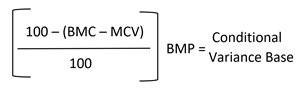

# インテリジェントな価格変更ルール：競合相手の条件付き相違

インテリジェントな価格変更ルールのセクションは次のとおりです。

- [[!UICONTROL Select Rule Type]](./intelligent-repricing-rules.md)
- [!UICONTROL Competitor Conditional Variances]
- [[!UICONTROL Price Adjustment]](./price-adjustment.md)
- [[!UICONTROL Floor Price]](./floor-price.md)
- [[!UICONTROL Optional Ceiling Price]](./optional-ceiling-price.md)

インテリジェントな価格変更ルールでは、Amazonの競合他社の価格を使用して、上場価格を決定します。 競合他社は、Amazonにリストしているのと同じ製品をリストしている他のセラーです。

同じ条件を持つ製品が存在する場合、基本一致価格は [最も低い競争相手](./lowest-competitor-pricing.md) 同じ条件の価格。 条件に一致する競合製品がない場合、基本一致価格は、「新規」、「再構築済み」から始まり、使用可能な条件を継続して下降する他の利用可能な競合相手条件を経由します。 条件が見つかった後、基準一致価格はその条件内の最低価格になります。

条件を含む製品がリストされている場合 `Used; Good` そして、基準マッチ価格と、競合相手が低価格で同じ条件で同じ製品を持っている場合、競合相手の価格が使用されます。 同じ条件を持つ競合相手が存在しない場合、システムは次の条件 ( つまり `New`. その条件で競合相手が見つかった場合は、最低価格が使用されます。

## 競合相手の条件付き相違の設定

条件の相違を _[!UICONTROL Competitor Conditional Variances]_」セクションに入力します。

の場合 **[!UICONTROL Conditional Variance]**、オプションを選択します。

- `Use all competitor's product conditions` - （デフォルト）製品を使用可能な条件と比較するタイミングを選択します（リストする条件に一致が存在しない場合）。

- `Use Only Matching Competitor's Product Condition`  — 同じ条件で、製品と競合他社の製品のみを比較する場合に選択します。 一致するものがない場合、製品の価格は _Magento価格のソース_ が [上場価格](./listing-price.md).

- `Apply Variance (if competitor's product condition differs)`  — 最初に、一致した製品条件との比較を試みることを選択します。 一致条件が存在しない場合、差異（パーセンテージ）は製品条件と最も低い競合相手の条件に対して適用されます。

   次の場合に _[!UICONTROL Apply Variance]_機能が選択されると、Amazonの各条件に対して追加の平方偏差フィールドが表示されます。 この機能を使用すると、競合他社とは異なる条件の製品を提供する場合に、インテリジェントな価格変更ルールを使用できます。 条件付き差異の計算を理解するには、最初に、すべての差異が基準一致価格から決定されることを理解する必要があります。

   表示される条件分散オプションは、 `Condition` を使用して条件値にマッピングされる [!DNL Commerce] [製品属性](https://docs.magento.com/user-guide/catalog/product-attributes.html){target="_blank"}. マッピングされたすべての条件に対して、1 ～ 100 の差異パーセンテージを定義できます。 例外は収集可能です。この場合、100 より大きい割合が適用される場合があります。

| フィールド | 説明 |
|--- |--- |
| [!UICONTROL Competitor Conditional Variances] | オプション： <ul><li>**[!UICONTROL Use all competitor's product conditions]**  — 商品をリストする条件に一致するものが存在しない場合、このオプションは使用可能な条件と一致します。 最初に条件の照合を試み、次に `New` 条件 `Used; Acceptable`.</li><li>**[!UICONTROL Use only matching competitor's product condition]**  — このオプションは、製品の条件と一致します。 一致がない場合は、 _[!UICONTROL Magento Price Source]_.</li><li>>**[!UICONTROL Apply variance (if competitor's product condition differs)]**  — このオプションは、最初に製品の条件との照合を試みます。 一致条件が存在しない場合は、製品条件と最も低い競合相手の条件に対して（パーセンテージで）差異が適用されます。</li></ul>  条件値にマッピングされる条件のリスト設定に基づいて表示される条件付き差異オプション ( [!DNL Commerce] [製品属性](https://docs.magento.com/user-guide/catalog/product-attributes.html){target="_blank"}. マッピングされたすべての条件に対して、1-100 の差異パーセンテージを示すことができます。 例外は収集可能です。この場合、100 より大きい割合が適用される場合があります。  この機能を使用すると、競合他社とは異なる条件の製品を提供する場合に、インテリジェントな価格変更ルールを使用できます。 条件付き差異の計算を理解するには、最初に、すべての差異が基準一致価格から決定されることを理解する必要があります。 |

## 条件付き差異の基準を計算

- 基準一致条件差異 (BMC) =基準一致価格競合相手の条件の差異。 前の例では、BMC は `New` 条件。
- Merchant Condition Variance (MCV) =製品の条件の差異。 前の例では、MCV =の平方偏差 `Used; Good` 条件。
- 基準一致価格 (BMP) = $7.99（前述）

条件付き分散の基準を計算する式は次のとおりです。

## 例

条件付き分散の設定を次に示します。

- BMC = 100（競合相手の条件=新規）
- MCV = 80 (Merchant condition = Used;良い )
- BMP = $7.99 （基準一致価格=一致競合相手条件の最低価格）

上記の条件付き差異基準計算を使用すると、条件付き差異基準= $6.39 が計算されます。この計算は、価格ルール処理に使用される競合相手の価格ソースです。詳しくは、 [価格調整](./price-adjustment.md).
