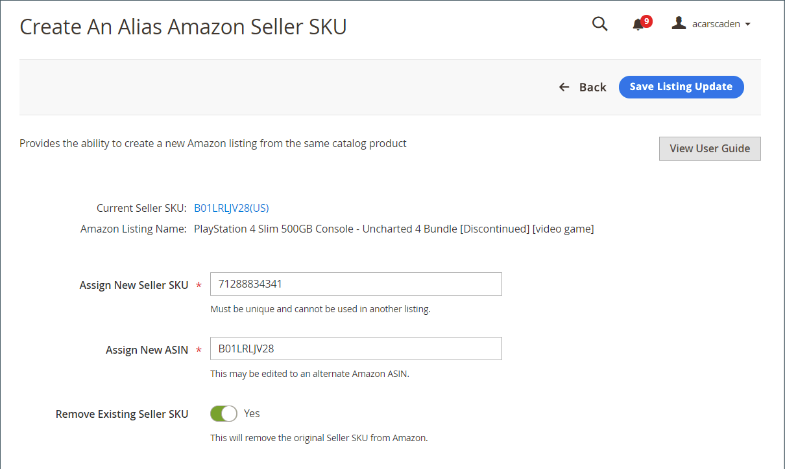

# Alias Amazon Seller SKUの作成

[!DNL Alias Amazon Seller SKU]は、[!DNL Commerce]カタログの同じ製品からAmazonリストを作成するために使用します。 Amazonの経験豊富なセラーの方は、在庫および発送用の[Amazon Global SKU](https://sellercentral.amazon.com/gp/help/external/help.html?itemID=201394090){target=&quot;_blank&quot;}およびMarketplace固有のSKUに詳しいかもしれません。 Amazonの販売チャネルに関する同様の原則に従い、AmazonセラーのSKUは複数の地域レベルで製品リスト情報を制御し、[!DNL Alias Amazon Seller SKU]は地域固有のレベルで製品リスト情報を制御するために使用できます。

この関数は、次の2つの機能を実行するために使用できます。

- [!DNL Commerce]カタログ製品の1つに[!DNL Alias Amazon Seller SKU]を作成して、地域固有のリスト情報を制御します。

   **例**:あなたは米国とカナダの両方の地域で売り手です。Amazonの各販売チャネルストアに割り当てることができるAmazon地域は、セットアップ中に1つだけです。 つまり、米国の地域が定義されたAmazonの販売チャネルストアと、カナダの地域が定義された別の店舗があります。 両方の店舗が、Amazonの販売者SKUおよびASIN製品属性を含む、両方の地域の情報を一覧表示するための[!DNL Commerce]カタログを共有します。 したがって、カタログ商品のリストは、店舗、共有価格、在庫/数量、その他の製品属性の両方で同じになります。 しかし、カナダの店舗の在庫はカナダの場所から出荷され、米国の店舗は米国の場所から出荷されます。 したがって、各店舗ごとに個別にリストの数量を制御する必要があります。 このタイプの地域固有のコントロールを実現するには、Alias Amazon Seller SKUを作成します。

   基本的に、同じカタログ製品にリンクされ、その地域で同じリストを再公開するために使用できるAlias Amazon Seller SKUを作成できます。

- [!DNL Alias Amazon Seller SKU]を作成し、[!DNL Commerce]カタログ製品の1つを2つのAmazonリストに一致させます。

   **例**:Amazonリストと一致するカタログ製品がある。Amazonには、同じ製品を表す複数のリストが頻繁に存在するので、同じ製品に対する別のAmazonリストが見つかりますが、Amazonには別のASINが割り当てられています。 商品の可視性を高めてを含めるには、カタログ商品を別のASINと照合し、両方のASIN値のリストを作成します。 これを実現するには、Alias Amazon Seller SKUを作成します。

   基本的に、1つのカタログ製品を2つ目のAmazonリストに一致させる[!DNL Alias Amazon Seller SKU]を作成し、新しく一致したASINのリストを作成できます。 このシナリオでは、同じカタログ製品に対して2つのAmazonリストを作成します。

   Alias Amazon Seller SKUを作成したら、リスト設定、ルールおよび上書きを使用して、その地域のリスト情報を制御できます。 リストのリストに対してリージョンごとに定義できる製品属性には、数量/在庫、履行方法、条件、製品の適格性、処理時間などがあります。

## 地域固有の目的で使用 {#region-specific}

_[!UICONTROL Product Listings]_ページ（_[!UICONTROL Inactive]_、_アクティブ_、_不適格_、または&#x200B;_終了_&#x200B;タブ）でリストを表示します。

1. _[!UICONTROL Actions]_の下で、**[!UICONTROL Create Alias Seller SKU]**をクリックします。

1. **[!UICONTROL Assign New Seller SKU]**&#x200B;には、一意の英数字の値を入力します。

   この値は一意である必要があります（カタログ内の他の製品やエイリアスには使用しません）。

1. **[!UICONTROL Assign New ASIN]**&#x200B;の場合は、変更を加えません。

   この値は、カタログ製品と一致する製品ASINで自動入力されます。 この値を変更すると、ASINに基づく2つのAmazonリストにカタログ製品が一致します。

1. 必要に応じて&#x200B;**[!UICONTROL Remove Existing Seller SKU]**&#x200B;オプションを切り替えます。

   - `Yes`  — リストを削除し、提供された新しい情報を使用してリストを作成することを選択します。

   - `No`  — リストを作成し、古いリストは変更しないでおきます。

1. **[!UICONTROL Save Listing Update]**&#x200B;をクリックします。

## 1つのカタログ製品を2つのAmazonリストと照合するために使用します

1. _[!UICONTROL Product Listings]_ページ（_[!UICONTROL Inactive]_、_[!UICONTROL Active]_、_[!UICONTROL Ineligible]_&#x200B;または&#x200B;_[!UICONTROL Ended]_タブ）でリストを表示します。

1. _[!UICONTROL Actions]_の下で、**[!UICONTROL Create Alias Seller SKU]**をクリックします。

1. **[!UICONTROL Assign New Seller SKU]**&#x200B;には、一意の英数字の値を入力します。

   この値は一意である必要があります（カタログ内の他の製品やエイリアスには使用しません）。

1. **[!UICONTROL Assign New ASIN]**&#x200B;には、一意の英数字の値を入力します。

   この値は、カタログ製品と一致する製品ASINで自動入力されます。 この値を変更すると、ASINに基づく2つのAmazonリストにカタログ製品が一致します。

1. 必要に応じて&#x200B;**[!UICONTROL Remove Existing Seller SKU]**&#x200B;オプションを切り替えます。

   - `Yes`  — リストを削除し、提供された新しい情報を使用してリストを作成することを選択します。

   - `No`  — 別のリストを作成し、古いリストは変更しないでください。

1. **[!UICONTROL Save Listing Update]**&#x200B;をクリックします。

| フィールド | 説明 |
|--- |--- |
| [!UICONTROL Assign New Seller SKU] | 元のAmazonセラーのSKUにリンクする新しい一意の英数字の値を入力します。 この数は、Amazonの販売チャネルでカタログ製品と照合するためにのみ使用されます。 どのSKU値も使用できますが、カタログでは1回のみ使用できます。 |
| [!UICONTROL Assign New ASIN] | カタログ商品を照合するリストのASIN値を入力します。 1つのカタログ製品をASINと照合し、同じ製品の別のリストを表示する場合にのみ、このフィールドを変更します。 この値は、Amazonによって割り当てられたASINと一致する必要があります。一致しない場合、Amazonによってリストが拒否されることはありません。 |
| [!UICONTROL Remove Existing Seller SKU] | オプション：<ul><li>**[!UICONTROL Yes]**  — リストを削除し、提供された新しい情報を使用してリストを作成することを選択します。新しいリストが「_[!UICONTROL Active]_」タブに表示され、古いリストが「_&#x200B;終了&#x200B;_」タブに移動します。</li><li>**[!UICONTROL No]**  — 別のリストを作成し、古いリストは変更しないでください。両方のリストは、新しいリストが作成された後、[アクティブ]タブに表示されます。</li></ul> |
