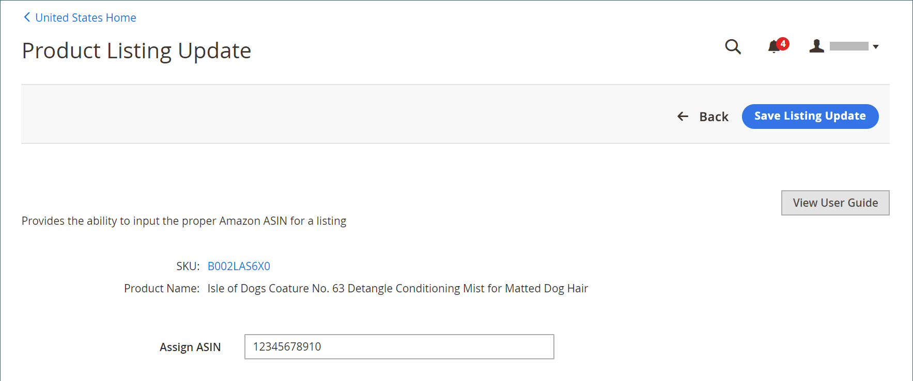

# 割り当てられた ASIN の編集

で商品に割り当てられたAmazon ASIN 値を編集できます [!DNL Commerce] カタログ。 この機能は、カタログ商品がAmazonのリストのいずれかに不適切に一致した場合に役立ちます。 リストに割り当てられた ASIN を変更しても、Amazonによって商品に割り当てられた ASIN は変更されません。 カタログ商品が一致するAmazonのリストのみが変更されます。

割り当てられた ASIN が変更された場合：

- [!DNL Commerce] 古い ASIN に添付されているAmazonの一覧を終了します
- Amazonで ASIN を検証します。
- 更新された ASIN のリストを作成します
- Amazon Sales Channel のリスト情報を更新しました

**_割り当てられた ASIN を編集するには：_**

1. のリストを表示 _[!UICONTROL Product Listings]_ページ （_[!UICONTROL Inactive]_, _[!UICONTROL Active]_、または_[!UICONTROL Ineligible]_ タブ）。

1. 次の下 _[!UICONTROL Actions]_を選択し、**[!UICONTROL Edit Assigned ASIN]**.

   このアクションにより、が開きます _[!UICONTROL Product Listing Update]_ページ。

1. の場合 **[!UICONTROL Assign ASIN]**&#x200B;新しい ASIN 値を入力します。

1. 変更を保存するには、をクリックします **[!UICONTROL Save Listing Update]**.

{width="600" zoomable="yes"}
