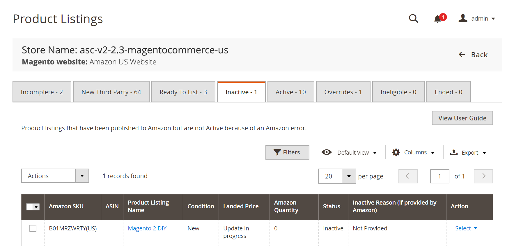

# 非アクティブなAmazonリスト

この _[!UICONTROL Inactive]_「 」タブには、Amazonに公開されたがアクティブでない製品が表示されます [!DNL Amazon Marketplace]. リストが非アクティブになる理由はいくつかあります。 例えば、特定のブランドをリストする資格がない場合があります。 非アクティブなリストは、Amazonのリスト標準および [!DNL Amazon Seller Central] アカウント権限。

の下 _[!UICONTROL Actions]_:

- **[!UICONTROL End Listing(s) on Amazon]**:選択したすべてのリストを [!DNL Amazon Marketplace]. 詳しくは、 [Amazonリストの終了](./end-listings-manually.md).

- **[!UICONTROL Edit Listing Overrides]**:リストの上書き設定を変更する場合に選択します。 詳しくは、 [上書き](./overrides.md) または [オーバーライドを編集または削除する](./creating-editing-overrides.md#edit-override-single-listing).

の下 **[!UICONTROL Select]** 内 _[!UICONTROL Action]_列：

- **[!UICONTROL View Details]**：リストの詳細 ( [アクティビティログのリスト](./product-listing-details.md#listing-activity-log), [Buy Box競合他社の価格](./product-listing-details.md#buy-box-competitor-pricing)、および [競合他社の最低価格](./product-listing-details.md#lowest-competitor-pricing). このアクションは表示専用です。 リストの詳細は変更できません。 詳しくは、 [詳細を表示](./product-listing-details.md).

- **[!UICONTROL Create Override]**：上書きを作成し、このリストに適用する場合に選択します。 詳しくは、 [オーバーライドの作成](./creating-editing-overrides.md).

- **[!UICONTROL Edit Assigned ASIN]**：カタログ製品に割り当てられた ASIN を変更する場合に選択します。 このアクションは、カタログ内の製品が間違った ASIN と一致した場合に使用されます。 詳しくは、 [割り当て済み ASIN の編集](./edit-assigned-asin.md).

- **[!UICONTROL Create Alias Seller SKU]**：同じカタログ製品からAmazonリストを作成するために使用できるエイリアス SKU(Stock Keeping unit) の作成を選択します。 詳しくは、 [Alias 販売者 SKU の作成](./create-alias-seller-sku.md).

- **[!UICONTROL Switch to Fulfilled by Amazon/Merchant]**：オーダーに関連付けられた達成方法を変更する場合に選択します。 詳しくは、 [達成者の設定を構成](./fulfilled-by.md#configure-fulfilled-by-settings).

- **[!UICONTROL End Listing]**：リストを [!DNL Amazon Marketplace]. 詳しくは、 [Amazonリストの終了](./end-listings-manually.md).

>[!NOTE]
>
>処理中のリストがある場合は、タブの上にメッセージが表示され、リストの数を示します。

{width="600" zoomable="yes"}

Amazonセールスチャネルのホームページは、いくつかの共通を共有します [workspace コントロール](./workspace-controls.md) を使用すると、表示されるデータをカスタマイズできます。

| 列 | 説明 |
|--- |--- |
| [!UICONTROL Amazon Seller SKU] | 製品、オプション、価格および製造元を識別するために、Amazonが製品に割り当てた SKU(Stock Keeping Unit)。 |
| [!UICONTROL ASIN] | アイテムを識別する 10 文字または数字の一意のブロック。  ASIN は、Amazon Standard Identification Numbers の略です。 ASIN は、項目を識別する 10 文字または数字の一意のブロックです。 書籍の場合、ASIN は ISBN 番号と同じですが、他のすべての製品の場合は、アイテムがカタログにアップロードされると新しい ASIN が作成されます。 ASIN は、Amazonの製品の詳細ページに、その品目に関する詳細と共に表示されます。 |
| [!UICONTROL Product Listing Name] | 製品の名前。 |
| [!UICONTROL Condition] | この [条件](./product-listing-condition.md) 製品の。 |
| [!UICONTROL Landed Price] | 商品の上場価格とその送料。 |
| [!UICONTROL Amazon Quantity] | 製品がAmazonに積極的にリストされたときに使用可能な数量。 |
| [!UICONTROL Status] | リストのステータス (Amazonで定義 )。 |
| [!UICONTROL Inactive Reason (if provided by Amazon)] | Amazonは、必ずしも非アクティブなリストへの理由を提供しているわけではなく、カスタマーサポートに連絡してリストの問題を解決することができます。 場合によっては、Amazonから理由が通知されることがあります。 これらの回答を表示するには、 **[!UICONTROL View Details]** 内 _[!UICONTROL Action]_列。 これらの問題が解決され、Amazonがエラーを削除すると、製品は_[!UICONTROL Active]_ タブをクリックします。 |
| アクション | 特定のリストに適用できる使用可能なアクションのリスト。 アクションを適用するには、 **[!UICONTROL Select]** 内 _[!UICONTROL Action]_列を選択し、次のオプションを選択します。<ul><li>[[!UICONTROL View Details]](./product-listing-details.md)</li><li>[[!UICONTROL Create Override]](./creating-editing-overrides.md)</li><li>[[!UICONTROL Edit Assigned ASIN]](./edit-assigned-asin.md)</li><li>[[!UICONTROL Create Alias Seller SKU]](./create-alias-seller-sku.md#region-specific)</li><li>[[!UICONTROL Switch to Fulfilled By Amazon/Merchant]](./fulfilled-by.md#configure-fulfilled-by-settings)</li><li>[[!UICONTROL End Listing]](./end-listings-manually.md)</li></ul> |
