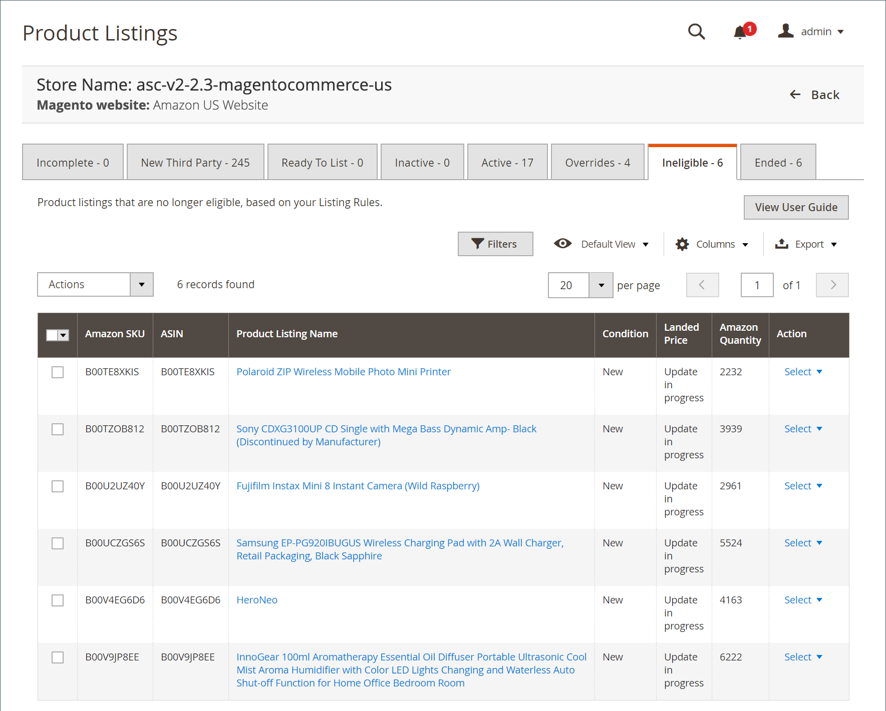

# 不適格なAmazonの一覧

「_[!UICONTROL Ineligible]_」タブには、現在Amazonで公開されているが、現在のリストルールに基づいたリストとしては実施不可のすべての商品が一覧表示されます。 以前の製品が適格で、その製品を不適格にするためにリストルールが変更された場合、製品に関連付けられた数量は 0 に低下し、その製品は_ 不適格 _としてマークされます。 ただし、[!DNL Amazon Seller Account] ージにはまだ存在します。

「_[!UICONTROL Ineligible]_」タブから製品を移動するには、製品が実施要件を満たすことを許可するように [ リストルールを変更 ](./listing-rules.md) します。

「_[!UICONTROL Ineligible]_」タブで使用できるアクションは次のとおりです。

_[!UICONTROL Actions]_の下：

- **[!UICONTROL End Listing(s) on Amazon]**：選択したすべての一覧を [!DNL Amazon Marketplace] から削除します。 [Amazon リストの終了 ](./end-listings-manually.md) を参照してください。

- **[!UICONTROL Edit Listing Overrides]**: リストの優先設定の変更を選択します。 [ オーバーライド ](./overrides.md) または [ オーバーライドの編集または削除 ](./creating-editing-overrides.md#edit-override-single-listing) を参照してください。

_[!UICONTROL Action]_列の&#x200B;**[!UICONTROL Select]**の下：

- **[!UICONTROL View Details]**: [ リスト活動ログ ](./product-listing-details.md#listing-activity-log)、[Buy Box競合他社価格 ](./product-listing-details.md#buy-box-competitor-pricing)、および [ 最低競合他社価格 ](./product-listing-details.md#lowest-competitor-pricing) を含むリスト詳細を表示します。 このアクションは表示専用です。 リストの詳細は変更できません。 [ 詳細を表示 ](./product-listing-details.md) を参照してください。

- **[!UICONTROL Create Override]**：上書きを作成し、このリストに適用することを選択します。 [ 上書きの作成 ](./creating-editing-overrides.md) を参照してください。

- **[!UICONTROL Edit Assigned ASIN]**: カタログ製品に割り当てられた ASIN を変更します。 このアクションは、カタログ内の製品が誤った ASIN と一致した場合に使用されます。 [ 割り当てられた ASIN の編集 ](./edit-assigned-asin.md) を参照してください。

- **[!UICONTROL Create Alias Seller SKU]**：同じカタログ商品からAmazon リストを作成する際に使用できるエイリアス SKU を作成します。 [Alias Seller SKU の作成 ](./create-alias-seller-sku.md) を参照してください。

- **[!UICONTROL Switch to Fulfilled by Amazon/Merchant]**：受注に関連付けられた履行方法の変更を選択します。 [ フルフィルメントの指定方法 ](./fulfilled-by.md#configure-fulfilled-by-settings) を参照してください。

- **[!UICONTROL End Listing]**: リストからリストを削除することを選択し [!DNL Amazon Marketplace] す。 [Amazon リストの終了 ](./end-listings-manually.md) を参照してください。

>[!NOTE]
>処理中のリストがある場合、リスト数はタブの上のメッセージに表示されます。

{width="600" zoomable="yes"}

Amazon sales channel のホームページには、表示するデータをカスタマイズできる共通の [workspace コントロール ](./workspace-controls.md) がいくつか用意されています。

## デフォルトの列

| 列 | 説明 |
|-----------------------------------|------------------------------------------------------------------------------------------------------------------------------------------------------------------------------------------------------------------------------------------------------------------------------------------------------------------------------------------------------------------------------------------------------------------------------------------------------------------------------------------------------------------------------------------------------------------------------------------------------------------------------------------------------------------------|
| [!UICONTROL Amazon Seller SKU] | 商品、オプション、価格、製造元を識別するためにAmazonによって商品に割り当てられた SKU （最小在庫管理単位）。 |
| [!UICONTROL ASIN] | 項目を識別する 10 文字または数字、あるいはその両方の一意のブロック。  ASIN は [!DNL Amazon Standard Identification Number] を表す。 ASIN は、項目を識別する 10 文字または数字（あるいはその両方）で構成される一意のブロックです。 書籍の場合、ASIN は ISBN 番号と同じですが、他のすべての製品の場合、カタログにアイテムがアップロードされると新しい ASIN が作成されます。 Amazonの商品詳細ページで、商品に関する詳細と共に商品 ASIN を見つけることができます。 |
| [!UICONTROL Product Listing Name] | 商品の名前。 |
| [!UICONTROL Condition] | 商品の [ 条件 ](./product-listing-condition.md)。 |
| [!UICONTROL Landed Price] | 商品の上場価格とその出荷価格。 |
| [!UICONTROL Amazon Quantity] | 商品がAmazonにアクティブに一覧表示されている場合に利用できる数量。 |
| [!UICONTROL Action] | 特定のリストに適用できる使用可能なアクションのリスト。 アクションを適用するには、_[!UICONTROL Action]_列の&#x200B;**[!UICONTROL Select]**をクリックし、オプションを選択します。<ul><li>[[!UICONTROL View Details]](./product-listing-details.md)</li><li>[ オーバーライドの作成 ](./creating-editing-overrides.md)</li><li>[[!UICONTROL Edit Assigned ASIN]](./edit-assigned-asin.md)</li><li>[[!UICONTROL Create Alias Seller SKU]](./create-alias-seller-sku.md#region-specific)</li><li>[[!UICONTROL Switch to Fulfilled By Amazon/Merchant]](./fulfilled-by.md#configure-fulfilled-by-settings)</li><li>[[!UICONTROL End Listing]](./end-listings-manually.md)</li></ul> |
