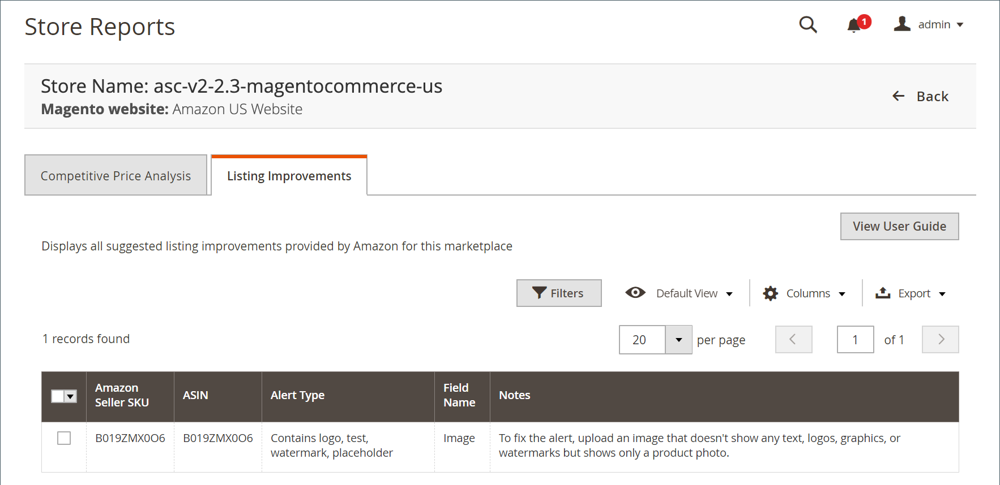

# [!UICONTROL Listing Improvements]

この [!UICONTROL Listing Improvements] レポートでは、Amazonからの提案を含む製品が表示され、リストの質が向上します。 これらの提案を確認すると、Amazon リスト内の商品のパフォーマンスを向上させることができます。 ログに使用可能なアクションはありません。 これはレビューのみの機能です。

Amazonからリストの機能強化を受けても、Amazonで商品をリストできるようになるわけではありません。

{width="600" zoomable="yes"}

## デフォルトの列

| 列 | 説明 |
|--------------------------------|------------------------------------------------------------------------------------------------------------------------------------------------------------------------------------------------------------------------------------------------------------------------------------------------------------------------------------------------------------------------------------------------------------------------------------------------------------------------------------------|
| [!UICONTROL Amazon Seller SKU] | 商品、オプション、価格、製造元を識別するためにAmazonによって商品に割り当てられた SKU （最小在庫管理単位）。 |
| [!UICONTROL ASIN] | 項目を識別する 10 文字または数字、あるいはその両方の一意のブロック。  ASIN は AEM を表す [!DNL Amazon Standard Identification Number]. ASIN は、項目を識別する 10 文字または数字（あるいはその両方）で構成される一意のブロックです。 書籍の場合、ASIN は ISBN 番号と同じですが、他のすべての製品の場合、カタログにアイテムがアップロードされると新しい ASIN が作成されます。 Amazonの商品詳細ページで、商品に関する詳細と共に商品 ASIN を見つけることができます。 |
| [!UICONTROL Alert Type] | リストに関するイシューのタイプを説明します。 例えば、「Missing」は、必須属性がないことを示します。 |
| [!UICONTROL Field Name] | Amazonの販売者に、改善が推奨されている詳細をリストするフィールド名。 |
| [!UICONTROL Notes] | Amazonから受け取った、提案された機能強化の説明。 |
