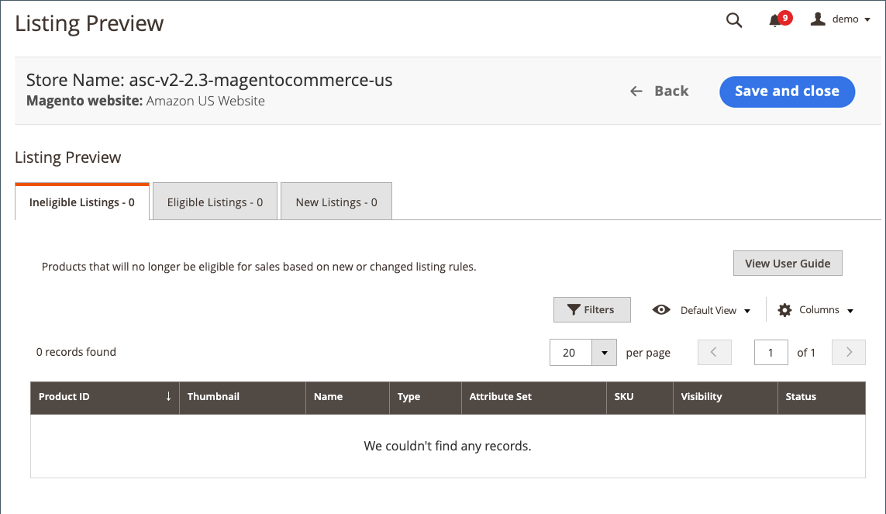

# Amazonリストルールの作成

リストルールはオンボーディング中に定義できますが、いつでも変更できます。 オンボーディング後、 [リストルール](./listing-rules.md) 店で [dashboard](./amazon-store-dashboard.md).

## オンボーディング中にリストルールを作成する

1. ストアに接続したら、 **[!UICONTROL View Store]** 追加されたストア用。

   ストア [dashboard](./amazon-store-dashboard.md) が `No products listed to Amazon` メッセージ。

1. クリック **[!UICONTROL Preview and List Eligible Products]**.

   この _[!UICONTROL Listing Rules]_ページが表示されます。

1. Amazonにリストされる製品の適格要件の条件を定義し、「 **[!UICONTROL Preview changes]**&#x200B;または、 **[!UICONTROL Preview changes]** をクリックして、この手順をスキップします。

   詳しくは、 [例：条件の定義](./ob-define-condition-example.md).

1. リストプレビューでリストを確認します。

   {width="600" zoomable="yes"}

   - **[!UICONTROL Ineligible Listings]**  — このタブに表示される製品は、現在のリストルール設定に基づくAmazonリストに登録する資格がありません。

     不適格な製品はAmazonに公開されません。 不適格な製品が既にAmazonにリストされていて、Amazonリストが [!DNL Commerce] カタログ製品、Amazonリストの数量の変更 `0` 製品の販売を防ぐ。 Amazonからリストを手動で削除するには、 [Amazonリストの終了](./end-listings-manually.md). Amazonの要件を満たさない製品は、ここに記載されていません。 これらの製品は、 [[!UICONTROL Inactive Listings] タブ](./inactive-listings.md).

     を変更するには `Ineligible` リスト `Eligible` リストを作成し、この手順を繰り返して、リスト規則を変更します。

   - **[!UICONTROL Eligible Listings]**  — このタブに表示される製品は、現在のリストルール設定に基づくAmazonリストへの登録が可能で、Amazonの要件に基づく適格です。 このタブには、読み込まれた既存のAmazonリストが含まれます ( **[!UICONTROL Import Third Party Listings]** に設定 `Import Listing` の [リスト設定](./listing-settings.md)) をクリックします。

   - **[!UICONTROL New Listings]**  — このタブに表示される製品には、 [!DNL Commerce] 現在のリストルール設定に基づいて新しくAmazonリストに登録できるカタログ製品を作成し、Amazonリストを作成します。

1. 完了したら、「 **[!UICONTROL Save and Close]**.

   ストア [dashboard](./amazon-store-dashboard.md) が開きます。

ストアのオンボーディングが完了すると、 [!DNL Commerce] とAmazonが開始されます。 Amazonの一覧がに読み込まれました [!DNL Commerce] を検索し、 [!DNL Commerce] カタログ。

Amazonの注文情報は、 _[!UICONTROL Recent Orders]_」セクションに表示されます。 詳しくは、 [ストアダッシュボード](./amazon-store-dashboard.md) または [注文の管理](./managing-orders.md).

>[!IMPORTANT]
>
>新しいストアのデフォルト値を持つ重要なストア設定（一覧、価格、ルール、達成など）がいくつかあります。 ストアが特定のニーズに合わせて設定されていることを確認するには、 [ストア設定](./default-store-settings.md) .

 [**デフォルトのストア設定に進む**](./default-store-settings.md)
