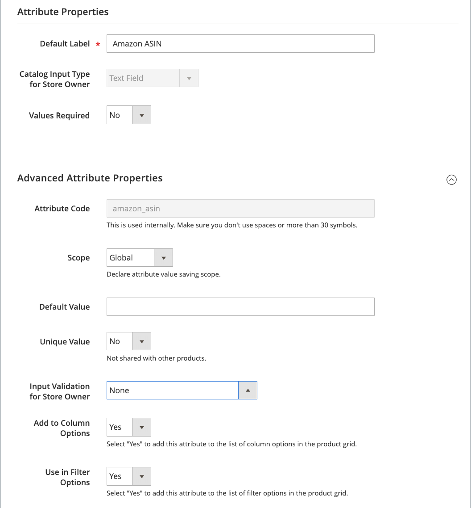

# Amazonの[!DNL Commerce]属性を作成します

[!DNL Amazon Seller Central]アカウントをオンボーディングする前に、[!DNL Commerce] [製品属性](https://docs.magento.com/user-guide/stores/attributes-product.html){:target=&quot;_blank&quot;}を追加して製品リストをマッピングすることをお勧めします。 オンボーディングが完了したら、[Amazonの販売チャネルホーム](./amazon-sales-channel-home.md)ページの「[属性](./managing-attributes.md)」タブで製品属性を管理できます。

以下の手順では、Amazon ASINとAmazon条件の[!DNL Commerce]属性を作成する方法について詳しく説明します。 Amazon EAN、Amazon ISBN、Amazon UPCなどの追加の属性を作成することをお勧めします。 また、Amazonの上場価格を価格ルールの価格ソースとして使用する場合は、Amazon Price属性も作成できます。 これらの属性は、オンボーディング時にリストと価格の設定を行う際に使用します。 また、Amazonのリストを作成する場合や、[!DNL Commerce]カタログを更新してAmazonのリストと同期する場合にも、これらの属性を使用します。

カタログ検索の設定を使用すると、対象となる[!DNL Commerce]製品をAmazonのリストにマッピングするのに役立つ、一致する検索パラメーターを設定できます。 マッピングされると、Amazonは、価格、数量、上書き、注文と製品の同期に関連するアクションを有効化します。

これらの値を定義すると完全一致の可能性が高まり、後で製品リストを手動で照合する必要が最小限に抑えられます。 オンボーディング[事前設定タスク](./amazon-pre-setup-tasks.md)に属性を追加すると、Amazonの販売チャネルは、オンボーディング中に製品を自動的に照合し、オンボーディング後にAmazonと[!DNL Commerce]の間で製品データを同期する可能性が高くなります。

Amazon ASIN属性のみを作成する場合（製品ごとにASIN値を追加しない場合）、[!DNL Commerce]製品はAmazonのリストと自動的に一致しない可能性があります。 _ストアレビュー_&#x200B;を使用して、手動で製品を照合できます。 ただし、手動での一致では、製品データの共有と同期に必要なデータ要素は作成されません。

>[!IMPORTANT]
>
>手動で一致した製品のASIN、UPCまたはその他のデータ要素を更新する場合は、次の両方の場所でデータを更新する必要があります。[!DNL Commerce]カタログと[!DNL Amazon Seller Central]アカウントの一覧。

## Amazon ASIN製品属性の作成

1. [!DNL Commerce]管理者にログインします。

1. 左側のメニューで&#x200B;**[!UICONTROL Stores]**&#x200B;をクリックします。

1. 「_[!UICONTROL Attributes]_」セクションで、「**[!UICONTROL Product]**」をクリックします。

1. 属性のプロパティを開くには、「**[!UICONTROL Add New Attribute]**」をクリックします。

1. **[!UICONTROL Default Label]**&#x200B;には、`Amazon ASIN`（属性の名前）と入力します。

1. **[!UICONTROL Catalog Input Type for Store Owner]**&#x200B;の場合は、`Text Field`を選択します。

1. **[!UICONTROL Values Required]**&#x200B;の場合は、`No`を選択します。

   Amazon上の商品をリストするにはAmazon ASINが必要ですが、カタログ商品の一部がAmazonにリストされない場合があります。

1. _[!UICONTROL Advanced Attribute Properties]_セクションを展開し、次のオプションを設定します。

   - **[!UICONTROL Attribute Code]**&#x200B;には、`amazon_asin`と入力します。

   - **[!UICONTROL Scope]**&#x200B;の場合は、`Global`を選択します。

   - **[!UICONTROL Unique Value]**&#x200B;の場合は、`No`を選択します。

   - **[!UICONTROL Input Validation for Store Owner]**&#x200B;の場合は、`None`を選択します。

   - **[!UICONTROL Add to Column Options]**&#x200B;の場合は、`Yes`を選択します。

   - **[!UICONTROL Use in Filter Options]**&#x200B;の場合は、`Yes`を選択します。

1. **[!UICONTROL Save Attribute]**&#x200B;をクリックします。

## Amazon条件製品属性の作成

1. [!DNL Commerce]管理者にログインします。

1. 左側のメニューで&#x200B;**[!UICONTROL Stores]**&#x200B;をクリックします。

1. 「_[!UICONTROL Attributes]_」セクションで、「**[!UICONTROL Product]**」をクリックします。

1. 属性のプロパティを開くには、「**[!UICONTROL Add New Attribute]**」をクリックします。

1. **[!UICONTROL Default Label]**&#x200B;には、`Amazon Condition`（属性の名前）と入力します。

1. **[!UICONTROL Catalog Input Type for Store Owner]**&#x200B;の場合は、`Dropdown`を選択します。

   _[!UICONTROL Manage Options (Values of your Attribute)]_セクションが表示されます。

1. **[!UICONTROL Values Required]**&#x200B;の場合は、`No`を選択します。

1. **[!UICONTROL Manage Options (Values for your Attribute)]**&#x200B;に対して、各条件オプションを追加します。

   標準のAmazon条件は次のとおりです。

   - `New: Refurbished: Used`
   - `Like New: Used`
   - `Very Good: Used`
   - `Good: Used`
   - `Acceptable: Collectible`
   - `Like New; Collectible`
   - `Very Good: Collectible`
   - `Good: Collectible; Acceptable`

1. **[!UICONTROL Add Option]**&#x200B;をクリックします。

1. デフォルトの選択条件に対して&#x200B;**[!UICONTROL Is Default]**&#x200B;オプションを選択します。

1. _[!UICONTROL Admin]_列に、追加する条件のラベルのテキストを入力します（`New`、`Used`、`Used-Like New`など）。

1. 必要に応じて&#x200B;**[!UICONTROL Add Option]**&#x200B;をクリックし、さらにオプションを追加します。

1. _[!UICONTROL Advanced Attribute Properties]_セクションを展開し、オプションを設定します。

   - **[!UICONTROL Attribute Code]**&#x200B;には、`amazon_condition`と入力します。

   - **[!UICONTROL Scope]**&#x200B;の場合は、`Global`を選択します。

   - **[!UICONTROL Unique Value]**&#x200B;の場合は、`No`を選択します。

   - **[!UICONTROL Input Validation for Store Owner]**&#x200B;の場合は、`None`を選択します。

   - **[!UICONTROL Add to Column Options]**&#x200B;の場合は、`Yes`を選択します。

   - **[!UICONTROL Use in Filter Options]**&#x200B;の場合は、`Yes`を選択します。

1. **[!UICONTROL Save Attribute]**&#x200B;をクリックします。

 [**アイコンAPIキーの追加または検証を続行**](./amazon-verify-api-key.md)
