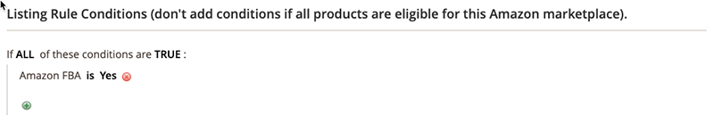

# 例：条件の定義

## 条件

条件内の太字の領域をクリックすると、様々なオプションを表示できます。

**選択したWebサイト内のすべての製品が適格な場合は、条件を追加しないでください。**

>[!NOTE]
>
>Amazonのシステムと直接通信する複雑なバックエンドプロセスのセットがあります。 リストしようとしている項目の数と、Amazonのシステムのビジー状態（ブラックフライデーなど）に基づいて、Amazonに項目がリストされるまでに時間がかかる場合があります。

[買い物かご価格ルールの作成](https://docs.magento.com/user-guide/marketing/price-rules-catalog-create.html){:target=&quot;_blank&quot;}の条件の節を参照してください。

## 条件の定義

このプロセスは、カタログの設定に応じて、簡単にも詳細にもできます。 定義条件の`ALL`または`ANY`が製品に対して`TRUE`または`FALSE`である場合、その製品がAmazonにリストされる資格を持つように条件を設定できます。

条件は、既存の製品属性値に基づきます。 すべての製品にルールを適用する場合は、「条件」セクションを空白のままにします。

>[!NOTE]
>
>特定の製品属性に基づいて条件を定義する場合は、属性の&#x200B;**[!UICONTROL Use for Promo Rule Conditions]**&#x200B;設定を`Yes`に設定します。 この設定は、属性の[ストアフロントのプロパティ](https://docs.magento.com/user-guide/catalog/product-attributes-add.html){:target=&quot;_blank&quot;}ページで使用できます。

この例のルールでは、_Amazon FBA_&#x200B;属性が`Yes`に設定されているすべてのカタログ製品に対してAmazonの適格性を設定するルールを定義しています。

ルールステートメントには2つの太字のリンクがあり、このリンクをクリックすると、ステートメントのその部分のオプションが表示されます。 太字オプションを変更せずに条件を保存すると、ルールがすべての製品に適用されます。

- **[!UICONTROL ALL]**&#x200B;をクリックし、`ALL`または`ANY`を選択します。
- **[!UICONTROL TRUE]**&#x200B;をクリックし、`TRUE`または`FALSE`を選択します。
- すべての製品にルールを適用する場合は、条件を変更しないでください。

これらの値の組み合わせを変更することで、様々な条件を作成できます。 この例では、次の条件が使用されます。

`If ALL of these conditions are TRUE:`

1. 条件行の先頭にある追加（）アイコンをクリックし、条件の組み合わせや製品属性など、条件の基となる属性を選択します。

   - **[!UICONTROL Conditions Combination]**  — 既存のセット内に別の条件のセットを作 `All/Any` 成で `True/False` きるようにします。

      

   - **[!UICONTROL Product Attribute]**  — 製品属性は、属性の設定によって異なります。属性をリストに表示するには、プロモーションルール条件での使用に合わせて設定する必要があります。 [製品属性](https://docs.magento.com/user-guide/stores/attributes-product.html){target=&quot;_blank&quot;}の&#x200B;_プロモーションルール条件_&#x200B;での使用を参照してください。

      **[!UICONTROL Product Attribute]**&#x200B;の下のリストで、条件の基礎として使用する属性を選択します。 この例では、選択された条件は`Amazon FBA`です。

      

      選択した条件が文に表示され、さらに2つの太字リンクが続きます。 オプションは、選択した製品属性によって異なります。

      設定した属性は変更できません。 属性を変更するには、行を削除し、新しい属性を追加する必要があります。 条件行を削除するには、行の末尾にある削除（）アイコンをクリックします。

      1. **[!UICONTROL is]**&#x200B;をクリックし、満たす製品の条件を示す比較演算子を選択します。

         この例では、比較演算子は`is`です。 使用可能なオプションは、前の手順で選択した属性によって異なります。 オプションには、一致する値（値の少なくとも1つを含まない、含まない、大きい、等しい、数値より小さいなど）など、様々な比較オプションが含まれます。 この例では、オプションは`is`と`is not`です。

      1. **[!UICONTROL ...]**&#x200B;をクリックし、条件の基となる属性値を選択します。

         オプションは、属性の設定によって異なります。 オプションを選択するか、条件のテキストまたは数値を入力するよう求められる場合があります。 この例では、「`Yes`」を選択します。

         選択した項目が、条件を完了するためにステートメントに表示されます。

         
   この条件は完了です。 この条件は、Amazon FBA属性が`Yes`に設定されている[!DNL Commerce]カタログ内の製品は、その地域と店舗のAmazonにリストする資格があることを意味します。 条件行をさらに追加して、対象となる製品を絞り込むことができます。

1，文に別の条件行を追加するには、手順1に戻り、必要な条件がすべて完了するまでプロセスを繰り返します。

条件文の行は、行の末尾にある削除（）アイコンをクリックすることで、いつでも削除できます。
