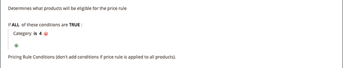

# 価格ルール条件

条件は、価格ルールに適した製品を決定します。 Amazonの価格ルールの条件を定義する手順は、[!DNL Commerce]の[買い物かごの価格ルール](https://docs.magento.com/user-guide/marketing/price-rules-cart.html){:target=&quot;_blank&quot;}の条件を定義するのと同じロジックに従います。

>[!IMPORTANT]
>
>[!DNL Commerce]カタログ内のすべての製品に価格ルールを適用する場合は、このセクションを空白のままにします。

条件内の太字の領域をクリックすると、様々なオプションを表示できます。

## 例：価格ルール条件を作成する

このプロセスは、カタログ設定に応じて、単純な場合も詳細な場合もあります。 条件の`ALL`または`ANY`が製品の`TRUE`または`FALSE`の場合、その製品が適用される価格ルールに適合するように条件を定義できます。

条件は、[製品属性](https://docs.magento.com/user-guide/catalog/product-attributes.html){:target=&quot;_blank&quot;}に基づきます。 すべての製品にルールを適用する場合は、「条件」セクションを空白のままにします。

>[!NOTE]
>
>特定の製品属性に基づいて条件を定義する場合は、**プロモーションルールの条件に使用**&#x200B;を属性の[ストアフロントプロパティ](https://docs.magento.com/user-guide/stores/attribute-product-create.html){:target=&quot;_blank&quot;}で`Yes`に設定する必要があります。

次の例では、`Books`カテゴリに定義されているすべての製品に25%の割引を適用するルールを定義します。

ルールステートメントには2つの太字のリンクがあり、このリンクをクリックすると、条件ステートメントのその部分のオプションが表示されます。 太字オプションを変更せずに条件を保存すると、ルールがすべての製品に適用されます。

- **[!UICONTROL ALL]**&#x200B;をクリックし、`ALL`または`ANY`を選択します。
- **[!UICONTROL TRUE]**&#x200B;をクリックし、`TRUE`または`FALSE`を選択します。
- すべての製品にルールを適用する場合は、条件を変更しないでください。

これらの値の組み合わせを変更することで、様々な条件を作成できます。 この例では、次の条件が使用されます。

`If ALL of these conditions are TRUE:`

1. 条件が適用される使用可能な属性を表示するには、条件行の先頭にある追加（）アイコンをクリックし、条件の基準となる属性を選択します。

   **[!UICONTROL Conditions Combination]**  — 既存の条件内に別のAND条件のセ `All/Any` ット `True/False` を作成する場合に選択します。

   

   **[!UICONTROL Product Attribute]**  — 使用可能な製品属性は、属 [性](https://docs.magento.com/user-guide/stores/attribute-product-create.html){:target=&quot;_blank&quot;}の設定によって異なります。リストに表示する属性の場合、[ストアフロントのプロパティ](https://docs.magento.com/user-guide/stores/attribute-product-create.html){:target=&quot;_blank&quot;}で、属性の&#x200B;*[!UICONTROL Use for Promo Rule Conditions]*&#x200B;を`Yes`に設定する必要があります。

   - **[!UICONTROL Product Attribute]**&#x200B;の場合、条件の基準として定義する属性を選択します。 この例では、選択された条件は`Category`です。

      

      選択した条件が文に表示され、さらに2つの太字リンクが続きます。 オプションは、選択した製品属性によって異なります。

      設定した属性は編集できません。 属性を変更するには、行を削除し、新しい属性を追加する必要があります。 条件行を削除するには、行の末尾にある削除（）をクリックします。

   - **[!UICONTROL is]**&#x200B;をクリックし、満たす製品の条件を示す比較演算子を選択します。

      この例では、比較演算子は`is`です。 使用できるオプションは、前の手順で選択した属性によって異なり、異なる比較オプションを含めることができます。 オプションには、少なくとも1つの値を含まない（または含まない）、およびより大きい、等しい、およびより小さい数値を含む、一致する値を含めることができます。 この例では、オプションは`is`と`is not`です。

   - **[!UICONTROL ...]**&#x200B;をクリックし、条件の基となる属性値を選択します。 オプションは、属性の設定によって異なります。

      オプションを選択するか、条件の値を入力するよう求められる場合があります。 この例では、フィールドは空白で表示されます。 ルールのカテゴリを選択するには、選択アイコン（）をクリックして選択オプションを表示します。 このルールは&#x200B;_Books_&#x200B;用で、**[!UICONTROL Books]**&#x200B;チェックボックスをオンにします。 カテゴリ番号が設定されます。 カテゴリの選択を受け入れるには、緑のチェックマークアイコン（）をクリックします。

      

      選択した項目が、条件を完了するためにステートメントに表示されます。

      

      この例の条件は完了です。 この条件は、定義されたカテゴリの帳簿(`4`)を持つ[!DNL Commerce]カタログ内の製品が、この価格ルールに該当することを意味します。 条件行をさらに追加して、対象となる製品を絞り込むことができます。

1. 文に別の条件行を追加するには、手順1に戻り、必要な条件がすべて完了するまでプロセスを繰り返します。

   条件文の行は、行の末尾にある削除（）アイコンをクリックすることで、いつでも削除できます。
