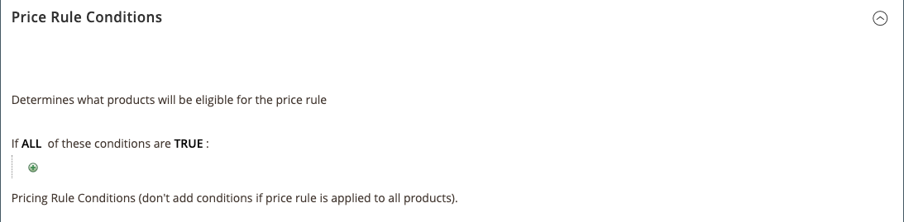

# 価格ルール条件

では、どの製品が価格ルールの対象となるかが条件によって決定されます。 Amazon 価格設定規則の定義は、Cart 価格ルールの条件を定義するのと同じロジックに従い  ます。 {target = &quot;_blank&quot;} の条件が定義されて [!DNL Commerce] います。

>[!IMPORTANT]
>
>カタログ内のすべての製品に価格ルールが適用されている場合は [!DNL Commerce] 、このセクションを空白のままにします。

条件が太字のすべての領域をクリックすると、様々なオプションが表示されます。

## 例: 価格ルール条件の作成

カタログ設定によっては、このプロセスを単純化したり詳細化したりすることができます。 条件がある場合、または製品の場合は、その `ALL` `ANY` `TRUE` `FALSE` 製品が価格設定ルールの適用対象となるように、条件を定義することができます。

条件は製品属性によって異なり  ます {target = &quot;_blank&quot;} すべての製品にルールを適用するには、条件セクションを空白のままにしておきます。

>[!NOTE]
>
>特定の製品属性に基づいて条件を定義する場合は、この属性を広告のルール条件として使用するには、この属性 **** `Yes`  の &#39; target = &quot;_blank&quot;} に設定する必要があります。

この例では、カテゴリで定義されているすべての製品に25% の割引を適用するルールを定義 `Books` します。

ルールステートメントには、2つのボールドのリンクがあります。ここでは、このリンクをクリックすると、condition ステートメントのその部分のオプションが表示されます。 「Bold」オプションは変更せずに条件を保存すると、すべての製品にルールが適用されます。

- **[!UICONTROL ALL]**&#x200B;をクリックして、またはを選択し `ALL` `ANY` ます。
- 「」をクリックし **[!UICONTROL TRUE]** て、「」または「」を選択し `TRUE` `FALSE` ます。
- すべての製品にルールを適用するには、条件を変更しないままにしておきます。

これらの値の組み合わせを変更することによって、異なる条件を作成することができます。 この例では、次の条件が使用されています。

`If ALL of these conditions are TRUE:`

1. 条件が適用される使用可能な属性を表示するには、  条件の基となる属性を選択します。

   **[!UICONTROL Conditions Combination]** - `All/Any` 既存の条件内に and 条件の別のセットを作成することを選択し `True/False` ます。

   

   **[!UICONTROL Product Attribute]** -使用可能な製品属性は、  {target = &quot;_blank&quot;} の属性の設定によって異なります。 リストに属性が表示されるようにするには、 *[!UICONTROL Use for Promo Rule Conditions]* ストアプロパティでこの属性をに設定する必要があり `Yes`  ます {target = &quot;_blank&quot;}。

   - については、 **[!UICONTROL Product Attribute]** 条件のベースとして定義する属性を選択します。 この例では、選択した条件がに `Category` なります。

      

      選択された条件がステートメントに表示され、その後にさらに2つのリンクが追加されています。 オプションは、選択した製品属性によって異なります。

      属性を設定した後は、編集することはできません。 属性を変更するには、その行を削除して、新しい属性を追加する必要があります。  ます。

   - をクリック **[!UICONTROL is]** して、製品の条件を満たす比較演算子を選択します。

      この例では、比較演算子はと `is` なります。 使用できるオプションは、前の手順で選択した属性によって異なります。異なる比較オプションを指定することもできます。 オプションには、条件に一致する値を含めることができますが、少なくとも1つの値を含めたり、それ以上の値を指定することはできません。 この例では、「」と「」のオプションを使用 `is` `is not` できます。

   - **[!UICONTROL ...]**&#x200B;をクリックし、条件の基準となる属性値を選択します。このオプションは、属性の設定によって異なります。

      この場合は、オプションを選択するか、条件の値を入力するよう求められます。 この例では、フィールドは空白になります。 ルールのカテゴリを選択するには、チューザアイコン (  オプションを表示します。 このルールはブック用です __ 。チェックボックスをオンにし **[!UICONTROL Books]** ます。 カテゴリナンバーが表示されます。 カテゴリの選択を確定するには、緑のチェックマークアイコン (  ます。

      

      選択されたアイテムがステートメントに表示され、条件を完成させます。

      

      この例では、このような条件が完了しています。 既に説明したように、この条件は、カタログ内で [!DNL Commerce] 定義されたカテゴリの本の ( `4` ) が、この価格設定ルールに適合していることを意味します。 条件行をさらに追加することで、対象製品をさらに絞り込むことができます。

1. ステートメントに別の条件行を追加するには、手順1に戻り、必要な条件がすべて満たされるまでこの処理を繰り返します。

   条件ステートメントの行を削除するには、  行の最後にある削除アイコン (削除アイコン) をクリックします。
