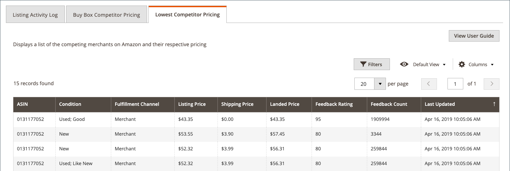

# リストの詳細の表示

この _[!UICONTROL Product Listing Details]_ページには、アクティブな製品リストについての追加情報が表示されます。これには、個々の SKU/製品に対する変更が記載されています。 この情報は、製品と個別の SKU や製品の変更について、競合指数を確認するのに役立ちます。 このページには、次のような追加情報が含まれています。

- **[!UICONTROL Listing Details]** -名前と Amazon 販売店 SKU を含む製品詳細
- **[!UICONTROL Listing Activity Log]** -価格、数量、在庫の変更など、このリストに対して発生したすべての変更の履歴記録。 これ以上のアクションは必要ありません。 このログは、変更履歴を確認するために用意されています。
- **[!UICONTROL Buy Box Competitor Pricing]** -Amazon の [[!DNL Buy Box]](./buy-box-competitor-pricing.md) 状態と競合他社の価格のデータ
- **[!UICONTROL Lowest Competitor Pricing]** -Amazon 競合企業が最も少ない価格設定およびフィードバック情報についての情報

Amazon セールスチャンネルのホームページ  は、表示されるデータをカスタマイズするための一般的なワークスペースコントロールの一部を共有しています。

## 詳細の一覧表示

表示される製品情報には、次のものが含まれます。

- _[!UICONTROL Amazon Name]_
- _[!UICONTROL Catalog (Magento) SKU]_
- _[!UICONTROL Amazon Seller SKU]_

## アクティビティログの一覧表示 {#listing-activity-log}

Amazon リストの最近のすべての操作が表示されます。 表示される情報は以下のとおりです。

- Amazon 売り手 SKU: リストに対して定義された Stock 保持ユニット (SKU) を識別します。
- アークサイン:10 桁の Amazon 製品 id を指定します。
- リスティングアクション: リストに対して発生したアクションの種類を識別します。
- コメント: 発生したリストアクションに関する詳細な情報を提供します。
- 実行時刻: アクションが発生した日時を示します。

 の一覧表示
__

## 「購入」ボックス競合企業の価格 {#buy-box-competitor-pricing}

このタブには、リストの位置を持っている Amazon マーチャントに関する情報が表示され [[!DNL Buy Box]](./buy-box-competitor-pricing.md) ます。 この情報は、Amazon によって競合企業が持つ価格がわかるようにするために使用されます。 表示される情報は以下のとおりです。

- アーク:10 桁の Amazon 製品識別子です。
- 売り手: 売り手であるかどうかを識別します。 [!DNL Buy Box]「はい」または「いいえ」を選択します。
- Condition: リストに対して定義されている条件を識別します。
- 定価: 出展がパブリッシュされた価格を示します。
- 送料: リストに追加された送料価格を示します。
- 「上陸価格」: 出展価格と出展価格を示します。
- 最終更新日: Amazon から価格情報が更新された日時を指定します。

## 競合企業の最低価格 {#lowest-competitor-pricing}

このタブには、同じリストにある Amazon の競合企業に関する情報が表示されます。 この情報を使用して、価格の配置や、 [ 競合企業の最も低い価格について理解することができ ](./lowest-competitor-pricing.md) ます。 表示される情報は以下のとおりです。

- アーク:10 桁の Amazon 製品識別子です。
- Condition: リストに対して定義されている条件を識別します。
- フルフィルメントチャネル: フルフィルメントの担当者を指定します。 オプション: マーチャント/Amazon。
- 定価: 出展がパブリッシュされた価格を示します。
- 送料: リストに追加された送料価格を示します。
- 「上陸価格」: 出展価格と出展価格を示します。
- フィードバックレート: 最も安い価格の商人の Amazon フィードバック格付けを識別します。
- フィードバック数: 最も安い価格の商人の Amazon フィードバック数を指定します。
- 最終更新日: Amazon から価格情報が更新された日時を指定します。

