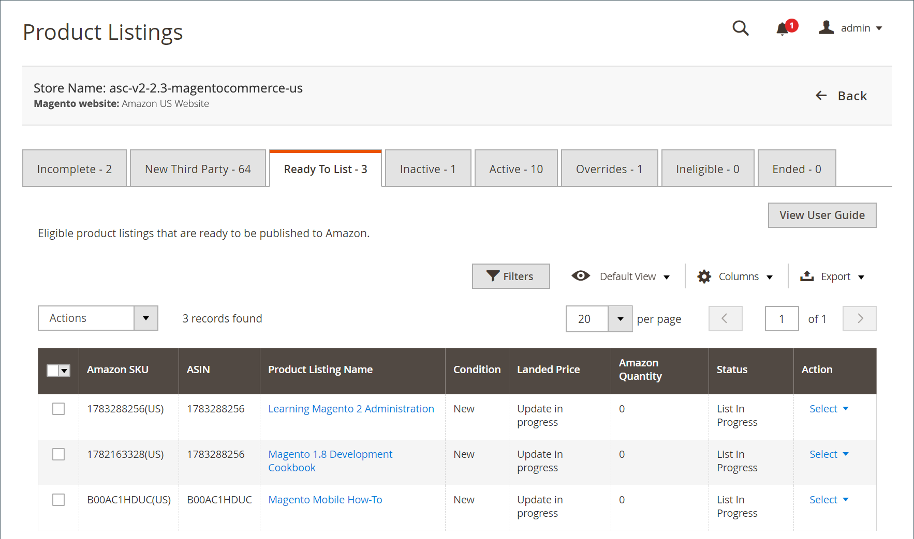

# [!UICONTROL Ready to List]

The _[!UICONTROL Ready to List]_タブには、 [!DNL Commerce] カタログ製品は、リスト設定を満たし、Amazon as a に公開する準備が整っています。**新規**リスト。 他のリストタブとは異なり、このタブは、 [_[!UICONTROL Product Listings]_](./managing-product-listings.md) ページに貼り付けます。

The _[!UICONTROL Ready to List]_タブは次の場合にのみ表示されます： [**[!UICONTROL Automatic List Action]**](./product-listing-actions.md) の設定が次の値に設定されている： `Do Not Automatically List Eligible Products`. この設定は、Amazonセールスチャネルに対し、新しいAmazonリストを手動で公開する必要があることを伝えます。

条件 [**[!UICONTROL Automatic List Action]**](./product-listing-actions.md) が `Automatically List Eligible Products`, Amazonセールスチャネルは、適格なカタログ製品の新しいリストを自動的に公開します。 新しいリストは自動的に公開されるので、 _[!UICONTROL Ready to List]_」タブは表示されません。

の下 _[!UICONTROL Actions]_:

- **[!UICONTROL Publish Product to Amazon]**：リストをに再公開する場合に選択します。 [!DNL Amazon Marketplace]. 詳しくは、 [Amazonリストの公開](./publish-listings-manually.md)

の下 **[!UICONTROL Select]** （内） _[!UICONTROL Action]_列：

- **[!UICONTROL Publish On Amazon]**：リストをに再公開する場合に選択します。 [!DNL Amazon Marketplace]. 詳しくは、 [Amazonリストの公開](./publish-listings-manually.md).

- **[!UICONTROL View Details]**：リストの詳細 ( [アクティビティログのリスト](./product-listing-details.md#listing-activity-log), [Buy Box競合他社の価格](./product-listing-details.md#buy-box-competitor-pricing)、および [競合相手の最低価格](./product-listing-details.md#lowest-competitor-pricing). このアクションは表示専用です。 リストの詳細は変更できません。 詳しくは、 [詳細を表示](./product-listing-details.md).

手動でおこなうオプションがいくつかあります [Amazonに新しいリストを公開する](./publish-listings-manually.md).

>[!NOTE]
>リストが処理中の場合は、タブの上のメッセージにリストの数が表示されます。

{width="600" zoomable="yes"}

## デフォルトの列

| 列 | 説明 |
|-----------------------------------|------------------------------------------------------------------------------------------------------------------------------------------------------------------------------------------------------------------------------------------------------------------------------------------------------------------------------------------------------------------------------------------------------------------------------------------------------------------------------------------|
| [!UICONTROL Amazon Seller SKU] | 製品、オプション、価格および製造元を識別するために、Amazonが製品に割り当てた SKU(Stock Keeping Unit)。 |
| [!UICONTROL ASIN] | アイテムを識別する 10 文字または数字の一意のブロック。  ASIN は、 [!DNL Amazon Standard Identification Number]. ASIN は、項目を識別する 10 文字または数字の一意のブロックです。 書籍の場合、ASIN は ISBN 番号と同じですが、他のすべての製品の場合は、アイテムがカタログにアップロードされると新しい ASIN が作成されます。 ASIN は、Amazonの製品の詳細ページに、その品目に関する詳細と共に表示されます。 |
| [!UICONTROL Product Listing Name] | 製品の名前。 |
| [!UICONTROL Condition] | The [条件](./product-listing-condition.md) 製品の。 |
| [!UICONTROL Landed Price] | 商品の上場価格とその送料。 |
| [!UICONTROL Amazon Quantity] | 製品がAmazonに積極的にリストされたときに使用可能な数量。 |
| [!UICONTROL Status] | リストのステータス (Amazonで定義 )。 |
| [!UICONTROL Action] | 特定のリストに適用できる使用可能なアクションのリスト。 アクションを適用するには、 **[!UICONTROL Select]** （内） _[!UICONTROL Action]_列を選択し、次のオプションを選択します。<ul><li>[[!UICONTROL Publish on Amazon]](./publish-listings-manually.md)</li><li>[[!UICONTROL View Details]](./product-listing-details.md)</li></ul> |

### リスト表示の準備ができた一般的な原因

- **[!UICONTROL Ready to List]**  — 製品はAmazon ASIN に一致し、リストに登録される予定です。 次の場合 [**[!UICONTROL Automatic List Action]**](./product-listing-actions.md) の設定が次の値に設定されている： `Do Not Automatically List Eligible Products`の場合、このステータスは、手動でリストに表示する準備ができた製品を表します。

- **[!UICONTROL List in Progress]**  — 製品リストはAmazonに送信され、Amazonからの受け入れの確認を待っています。
