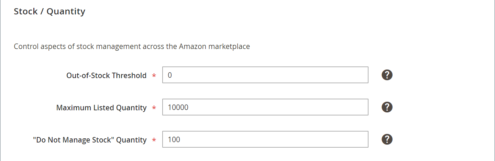

# 在庫/数量

*[!UICONTROL Stock/Quantity]* 設定は、ストア一覧の設定に含まれています。 一覧の設定は、ストアのダッシュボードからアクセスされ  ます。

この設定を使用して、店頭にある製品数量の詳細 [!DNL Commerce] を、お客様のアカウントの数量と同期させることが [!DNL Amazon Seller Central] できます。 このツールは強力であり、追加広告に使用することができます。これは、在庫状況を維持したまま、買い手に緊急性を表示することです。 例えば、商人によっては、倉庫内の特定の SKU に150のアイテムが含まれていて、Amazon によってすべてのインベントリが購入されるようにする必要がある場合があります。 他の商人は、一度に1つのアイテムだけをリストすることで、エンドユーザーに scarcity を作成することもできます。 この場合は、 *[!UICONTROL Maximum Listed Quantity]* をに設定し `1` ます。

Quantity は、設定に基づいて、 **[!UICONTROL Amazon Marketplace Country]** ストア統合時に定義される「地域」属性です  。 製品の数量に変更が加えられると、その変更は、 [!DNL Amazon Seller SKU] amazon stores さんが同じ国に販売した amazon ストアにあるすべての amazon リストに反映されます。 米国で共有に変更を加え [!DNL Amazon Seller SKU] ても、別の国用に設定された Amazon ストアには影響しません。 最初の Amazon store によって (最も日付の作成日が付いて) 統合されます。これは、quantity 設定において優先度を制御します。

>[!NOTE]
>
>Adobe Commerce および Magento Open Source 2.3. x のユーザーは、追加の設定を使用しなくても、インベントリ管理拡張機能の使用をサポートします。 詳しくは  、インベントリの管理 {target = &quot;_blank&quot;} を参照してください。

## 素材設定の設定 {#configure-stock--quantity-settings}

1. **[!UICONTROL Listing Settings]** Store のダッシュボードのをクリックします。

1. セクションを展開し **[!UICONTROL Stock / Quantity]** ます。

1. (必須) には、その製品が **[!UICONTROL Out-of-Stock Threshold]** Amazon リストに適合するように、製品の最小数の数値を入力します。

   初期設定では、と `0` なります。 製品の [!DNL Commerce] 在庫数がこの値よりも小さい場合は、各 amazon リストが Amazon を通じて販売されることになります。

1. **[!UICONTROL Maximum Listed Quantity]**(必須) には、Amazon リストに表示する量を数値で指定します。

   この設定によって、入力した値に該当するすべての Amazon リストの一覧が表示されます。 品目が販売されると、Amazon の一覧の量は変更されません。 実際の製品の数量が高いまたは少ない場合でも、表示される一覧の数量には常にこの値が使用されます。 この設定は、通常は製品インベントリが管理されていない場合に使用されます。 例えば、カタログに量80の製品が含まれているとし [!DNL Commerce] ます。 に設定されている場合は `10` 、Amazon リスティングには、製品の販売時に使用可能な空き容量が常に表示され `10` ます。

1. **[!UICONTROL "Do Not Manage Stock" Quantity]**(必須) には、Amazon リストに表示する数量の値を入力します。

   Amazon を取得するには、有効な量を公開する必要があります。 [!DNL Commerce]在庫を管理するように設定されていないが、Amazon にそれらの製品を表示するように設定されている場合は、ここに入力した「利用可能な量」を含む一覧が公開されます

1. 完了したら、をクリックし **[!UICONTROL Save listing settings]** ます。

| 名 | つい |
|---|---|
| [!UICONTROL Out-of-Stock Threshold] | Amazon リストに対象製品を保存できるようにするために、製品の最小数の数値を入力します (デフォルトは `0` )。  製品の [!DNL Commerce] 在庫数がこの値よりも小さい場合は、各 amazon リストが Amazon を通じて販売されることになります。 |
| [!UICONTROL Maximum Listed Quantity] | Amazon リストに表示する量の数値を入力します。  品目が販売されると、Amazon リストにはここで入力した数量が共にパブリッシュされます。 この設定は、通常は製品インベントリが管理されていない場合に使用されます。  例えば、表示される最大の数量値をとして入力し `10` ます。 製品の実際の数量は、と `80` なります。 この値がに設定されている `10` ので、Amazon リスティングには、で利用可能な量が常に表示され `10` ます。 利用可能な数量は、在庫数が少ない場合でも、定義された値と共に必ず表示されます。 |
| [!UICONTROL "Do Not Manage Stock" Quantity] | Amazon リストの表示量の値を入力します。  Amazon を取得するには、有効な量を公開する必要があります。 「 [!DNL Commerce] 株式管理」が設定されていないにもかかわらず、その製品が Amazon に一覧表示されるように設定されている場合は、ここで入力した値の利用可能な量を含むリストが公開されます。 |

**クイックアクセス** - [!UICONTROL Listing Settings] セクション

- [[!UICONTROL Product Listing Actions]](./product-listing-actions.md)
- [[!UICONTROL Third Party Listings]](./third-party-listing-settings.md)
- [[!UICONTROL Listing Price]](./listing-price.md)
- [[!UICONTROL (B2B) Business Price]](./business-pricing.md)
- [[!UICONTROL Stock / Quantity]](./stock-quantity.md)
- [[!UICONTROL Fulfilled By]](./fulfilled-by.md)
- [[!UICONTROL Catalog Search]](./catalog-search.md)
- [[!UICONTROL Product Listing Condition]](./product-listing-condition.md)

## 例: リストの最大数

品目が販売されると、Amazon リスティングによってこの量に一覧されます。

例えば、次のように設定されている場合、その *[!UICONTROL Maximum Listed Quantity]* `12` 製品の数量は80であっても、Amazon の一覧には量12が表示され [!DNL Commerce] ます。

を設定した *[!UICONTROL Maximum Listed Quantity]* 場合 `1` 、適格な製品がの数量とともに一覧表示され `1` ます。 品目が販売されると、システムは製品を検索 [!DNL Commerce] し、追加の株価がある場合は、Amazon 上の数量を使用して項目を再一覧表示し `1` ます。

このオプションは、通常、数量1の注文の製品にとって重要な場合があります。 また、Amazon の一覧を表示すると、買物客の緊急性も増加します。

