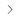

# ア [!DNL Amazon Seller Account] ットを使用したストア統合

Amazonのセールスチャネルの使用を開始するには、Amazon セールスチャネルストアを作成（追加）し、[!DNL Amazon Seller Account] に接続する必要があります。 この 2 つの手順により、[!DNL Commerce] アカウントとAmazon アカウントを統合して、データの共有や商品の同期などを行うことができます。

_ストアに接続するには、[!DNL Amazon Seller Central] アカウントのプライマリログイン資格情報（販売者アカウントの作成に使用するメールまたは電話）が必要です。_

>[!NOTE]
>
>初めてストアに統合した後、アクセス権を再度付与してAmazonへのAmazon Sales Channel 接続を更新するよう、毎年プロンプトが表示されます。 この認証は、セラーセントラル アカウントの _設定_ > **ユーザーの権限 _ページの_Amazon MWS 開発者権限** セクションにある **現在の認証** テーブルで更新または取り消すことができます。

## Amazon ストアを追加する

1. _管理者_ サイドバーで、**マーケティング**/_チャネル_/**AmazonSales Channel** に移動します。

   最初のAmazon セールスチャネルストアを追加すると、_Pre-Setup Tasks_ モーダルが表示されます。 最初の店舗が追加されたら、左側のメニューの [Amazonセールスチャネルのホーム ](./amazon-sales-channel-home.md) ページの _ラーニングと準備_ で、事前設定タスクにアクセスできます。

1. 「**[!UICONTROL Add Amazon Store]**」をクリックします。

   _[!UICONTROL Add Amazon sales channel]_ページが開きます。

   {width="500" zoomable="yes"}

1. **[!UICONTROL Magento Website to use for Amazon Listing]** しくは、このAmazon セールスチャネルストアに接続する [!DNL Commerce] web サイトを選択します。

   また、この設定は、[Amazon注文の読み込み ](./order-settings.md) 用のデフォルトの [!DNL Commerce] ストアも定義します。

1. **[!UICONTROL Email Address]** しくは、希望する連絡先のメールアドレスを入力します。

1. **[!UICONTROL New Store Name]**：新しいAmazonセールスチャネルストアのわかりやすい名前を入力します。

   >[!NOTE]
   >
   >この名前は [!DNL Commerce] 参照としてのみ使用され、[Amazon sales channel home](./amazon-sales-channel-home.md) ページのストアを示します。 チームが簡単に識別できるものにしたい。 例えば、米国で販売されているAmazonのストアは `Amazon Store USA` という名前になります。

1. **[!UICONTROL Amazon Marketplace Country]**：このAmazonの販売店が商品を販売している地域/国を選択します。 オプション：

   - 米国
   - カナダ
   - メキシコ
   - 英国

1. _[!UICONTROL Map your Magento attributes to Amazon]_セクションで、次の操作を行います。

   - **[!UICONTROL Product ID on the Amazon market]** しくは、以下で選択した [!DNL Commerce] 属性にマッピングするAmazon属性を選択します。

     この ID は、[!DNL Commerce] カタログ内の対応する製品を正しく照合するのに役立ちます。

   - **[!UICONTROL Map a Magento attribute]** しくは、上記で選択したAmazon属性にマッピングする [!DNL Commerce] product 属性を選択します。

     [ 属性のマッピング ](./ob-creating-magento-attributes.md) を使用すると、Amazonのリストが [!DNL Commerce] カタログの対応する商品に正しく一致していることを確認できます。

1. 「**[!UICONTROL Connect]**」をクリックします。

   ダイアログが閉じ、新しいストアが [Amazon sales channel home](./amazon-sales-channel-home.md) ページに表示されて確認メッセージが表示されます。

## [!DNL Amazon Seller Central] へのストアの接続

1. ストアダッシュボードで、ストアカードの **[!UICONTROL Connect store]** をクリックして、新しいタブで [!DNL Amazon Seller Central] を起動します。

1. [!DNL Amazon Seller Central] アカウントの資格情報を入力し、「**[!UICONTROL Sign in]**」をクリックします。

   この接続を完了するには、プライマリユーザーのログイン資格情報（販売者アカウントの作成に使用するメールまたは電話）を使用して、[!DNL Amazon Seller Central] アカウントにログインする必要があります。

1. プロンプトが表示されたら、Amazonから受け取るコードを入力してAmazon 2 要素認証（2FA）を行い、「**[!UICONTROL Sign in]**」をクリックします。

1. _[!UICONTROL Amazon Marketplace Web Service]_の確認ページで、「[!UICONTROL I understand...]」チェックボックスを選択し、「**[!UICONTROL Next]**」をクリックします。

1. _[!UICONTROL You are almost done]_のメッセージで、[**[!UICONTROL Continue]**] をクリックします。

   Amazon セールスチャネルに対して、[!DNL Amazon Seller Central] アカウントにアクセスしてデータを共有する権限を付与しました。 Amazonページが閉じ、確認メッセージが表示されます。

   「[Amazon販売チャネルのホーム ](./amazon-sales-channel-home.md)」ページが開き、Amazonのストアカードが表示されます。

   ストアダッシュボードを表示するには、ストアカードの **[!UICONTROL View Store]** をクリックします。

{width="600" zoomable="yes"}

これで、新しいAmazon セールスチャネルストアが [!DNL Amazon Seller Central] アカウントに接続されました。

[**リストルールの作成を続行**](./ob-create-listing-rule.md)
