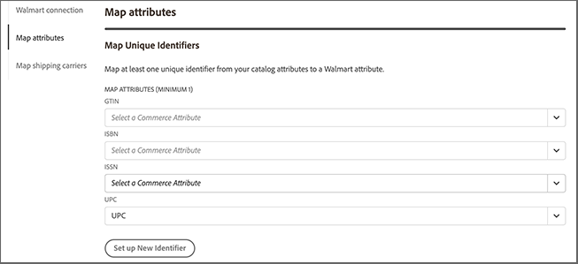

# カタログ属性のマッピング

一覧を接続する前に [!DNL Commerce] 対象： [!DNL Walmart Marketplace]、から少なくとも 1 つの一意の ID をマッピングする必要があります [!DNL Commerce] ウォルマートから対応する識別子へのカタログ。

このステップは、に一致する必要があります。 [!DNL Commerce] 既存の製品 [!DNL Walmart] 製品データのリスト化と同期 [!DNL Commerce] および [!DNL Walmart]. この [!DNL Commerce] 製品には、に必要な次の製品識別子（製品 ID）のいずれかに一致する製品属性が 1 つ以上必要です [!DNL Walmart].

**必須 [!DNL Walmart] 製品 ID**

| **許可型** | **名前** | **目的** | **使用できる数字** |
|-------------------|--------------------------------------|--------------------------------------------------------------------------------------------------------------------------------------------------|-----------------------|
| GTIN | 国際貿易品目 | 世界中で使用される汎用 | 14 桁 |
| ISBN | 国際標準簿番号 | ペーパーバック、ハードカバー及び電子書籍 | 10 桁または 13 桁 |
| ISSN | 国際標準シリアル番号 | 8 桁のシリアル番号。雑誌、雑誌、新聞、あらゆる種類の定期刊行物を識別するために使用されます。印刷および電子 | 8 桁 |
| UPC | ユニバーサル製品コード | 標準小売追跡コード | 12 桁 |

カタログに一致する属性がない場合、 [既存のカタログ属性を追加または変換する](https://experienceleague.adobe.com/docs/commerce-admin/catalog/product-attributes/product-attributes.html).

## 一意の識別子のマッピング

1. から **[!UICONTROL Listings]** または **[!UICONTROL Orders]** 販売チャネル ストアのページで、次を選択します **[!UICONTROL Channel Settings]**.

1. 日付： **[!UICONTROL Channel Settings]**&#x200B;を選択 **[!UICONTROL Map Attributes]**.

   - の検索 [!DNL Walmart Marketplace] マッピングする属性。

   - 対応する属性をから選択します [!DNL Commerce] カタログを保存します。

     次の例では、 [!UICONTROL Walmart Marketplace UPC] 製品カタログの UPC 属性に対する属性。

     {width="600" zoomable="yes"}

   - を選択 **[!UICONTROL Save]**.
