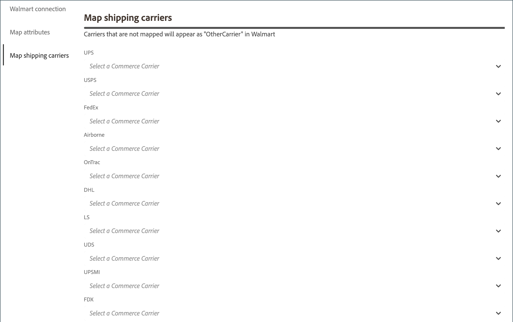

# 配送業者のマップ

オーダーの出荷を [ 処理 ](process-orders.md#ship-an-order) する前に、[!DNL Walmart Marketplace] のオーダーについて、ウォルマートの優先出荷搬送を [!DNL Commerce] で対応する搬送にマップして、[!DNL Walmart] と [!DNL Commerce] の間で出荷データを同期できるようにします。

優先する通信事業者にマッピングしないCommerceの通信事業者には、[!DNL Walmart] で *[!UICONTROL Other Carrier]* というラベルが付けられます。

**前提条件**

出荷搬送をマッピングする前に、次のタスクを実行します。

1. [!DNL Walmart Marketplace] しくは、[ オンタイム配信の配送方法と配送のベストプラクティス ](https://sellerhelp.walmart.com/s/guide?article=000009473) を確認してください。

1. [!DNL Commerce] ストアの [[!UICONTROL Shipping Carrier]](https://experienceleague.adobe.com/docs/commerce-admin/stores-sales/delivery/shipping-carriers/carriers.html) と [[!UICONTROL Shipping Settings]](https://experienceleague.adobe.com/docs/commerce-admin/config/sales/shipping-settings.html) の設定を確認し、[!DNL Walmart Marketplace sales] の設定が最適化されていることを確認します。

## 配送業者のマッピング

1. **[!UICONTROL Listings]** または **[!UICONTROL Orders]** ページから、「**[!UICONTROL Channel Settings]**」を選択します。

1. **[!UICONTROL Channel Settings]** で「**[!UICONTROL Shipping Carriers]**」を選択します。

   {width="600" zoomable="yes"}

1. 表示される [!DNL Walmart] の優先通信事業者ごとに、その通信事業者が使用可能な場合は、ドロップダウンから [!DNL Commerce] の通信事業者名を選択します。

1. 「**[!UICONTROL Save]**」を選択して、設定を適用します。

